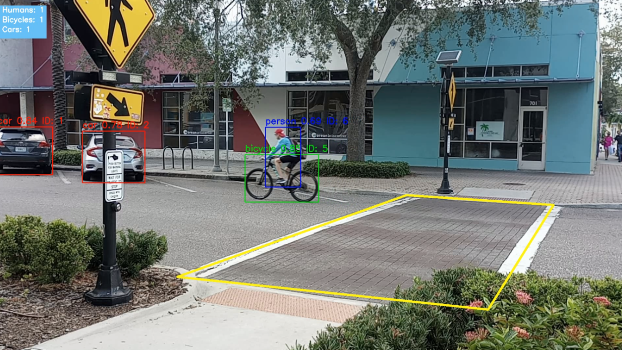

# Traffic Monitoring Application

## Overview
This project is a **traffic monitoring application** designed to **identify and count** cars, bicycles, and pedestrians passing through a crosswalk. The application uses **OpenCV** for video processing and a **pretrained YOLO model** for object detection.



## Objectives
- Load and process a traffic video.
- Identify and track vehicles, bicycles, and pedestrians.
- Accurately count objects passing through a defined crosswalk area.
- Prevent double-counting or missing detections using object tracking.

## Technologies Used
- **OpenCV** – Video processing and frame manipulation.
- **YOLO** – Object detection for identifying cars, bikes, and pedestrians.
- **Python** – Implementation of tracking and counting logic.

## Features
✔ **Traffic Video Processing** – Uses OpenCV's `VideoCapture` to read the input video.  
✔ **Object Detection with YOLO** – Detects people, bikes, and vehicles in real-time.  
✔ **Crosswalk Identification** – The crosswalk is marked with a yellow boundary.  
✔ **Object Tracking System** – Assigns unique IDs to detected objects.  
✔ **Accurate Counting Mechanism** – Ensures each object is counted only once.  
✔ **Prevention of Double-Counting** – Maintains a set of counted object IDs.  
✔ **Live Count Display** – Shows the number of people, bikes, and cars in the scene.

## How It Works
1. The application **loads the traffic video** using OpenCV.
2. The **crosswalk is marked** within the frame.
3. The **YOLO model detects objects** and assigns them unique IDs.
4. As objects **move through the scene**, they are tracked across frames.
5. Objects are **counted once they cross the middle of the scene** to avoid overlapping issues.
6. The current count for each object type is displayed in the **upper left corner** of the video.

#
## Installation & Setup
### **Clone the Repository**
```bash
git clone https://github.com/NateDixon47/Computer-Vision-Project.git
cd Computer-Vision-Project
pip install opencv-python numpy ultralytics shapely
```
### **How to run**
1. Download the Traffic Video from the link: https://drive.google.com/file/d/1O15jClYf2IP3tWXGKX0hARMP5ktqHw43/view
2. Place the Traffic Video in the project directory.
3. Run the **'counttraffic.py'** script.
4. The output video will be saved to the project directory.


